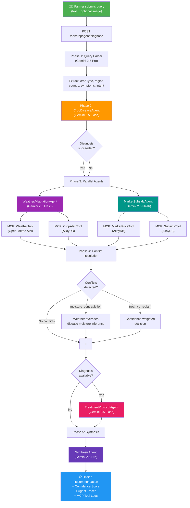
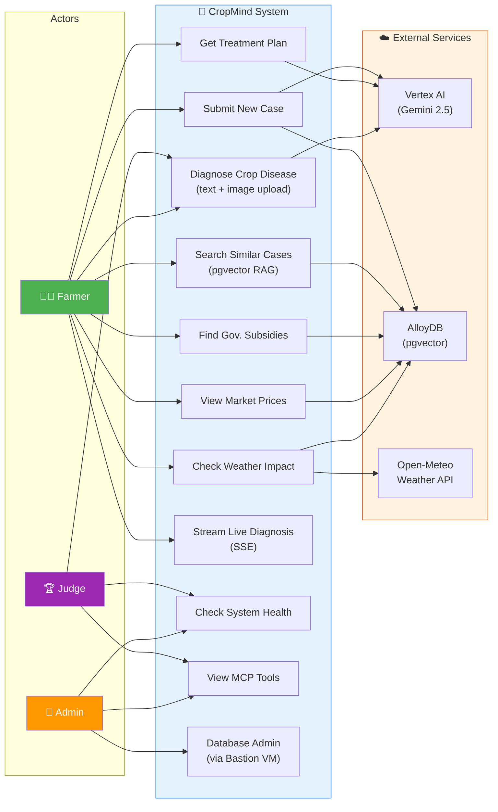
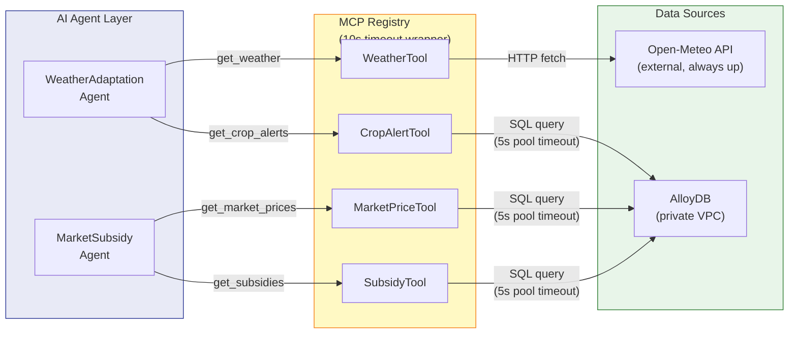
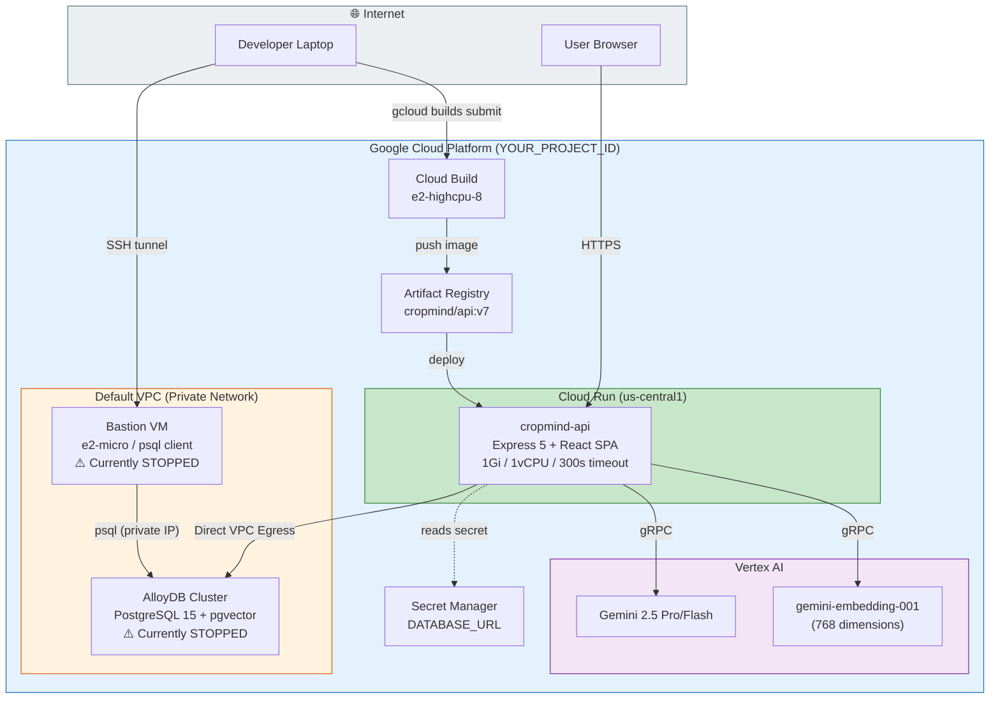
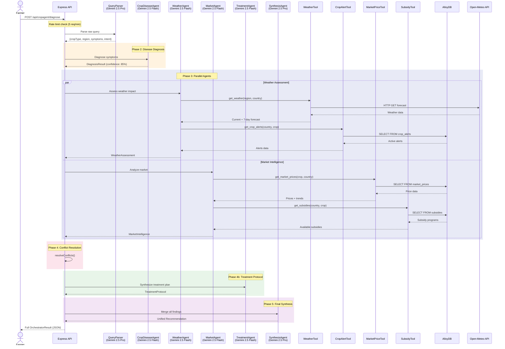

# CropMind — System Diagrams

## 1. Process Flow Diagram — Multi-Agent Orchestration Pipeline

---

## 2. Use-Case Diagram

---

## 3. Data Flow Diagram — MCP Tool Integration

---

## 4. Deployment Architecture Diagram

---

## 5. Sequence Diagram — Full Diagnosis Request

