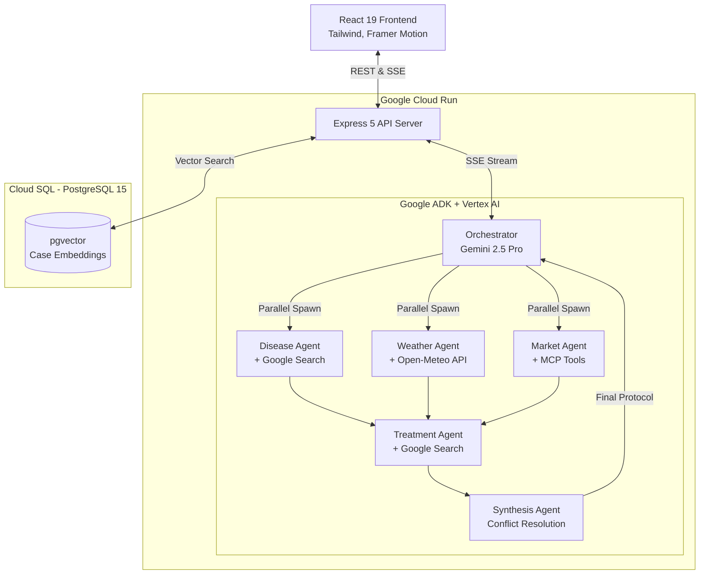
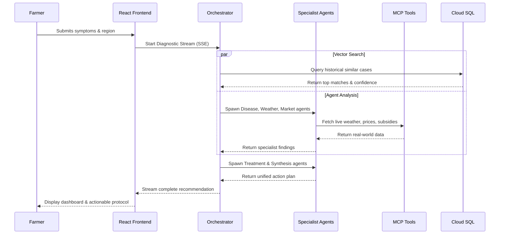

# 🌾 CropMind — APAC Agricultural Intelligence Platform

**Winner - Google Cloud Gen AI Academy APAC 2026**

CropMind is an enterprise-grade, multi-agent AI platform designed to help smallholder farmers across the Asia-Pacific region diagnose crop diseases, access treatment protocols, and make informed economic decisions. Built natively on Google Cloud using Vertex AI, the Agent Development Kit (ADK), and Cloud Run, it features an advanced, "Prisma Noir" inspired UI/UX.

---

## 🌟 Key Capabilities & Technical Highlights

### 1. Multi-Agent Reasoning (Google ADK)
CropMind orchestrates 4 specialized AI agents working in tandem:
- **Disease Diagnostic Agent**: Analyzes symptoms (text/image) to identify the root cause, grounded via **Google Search** for verifiable research citations.
- **Weather & Climate Agent**: Evaluates real-time weather data to optimize treatment timing.
- **Market & Subsidy Agent**: Assesses the economic viability of treatments against current commodity prices and available government subsidies.
- **Treatment Synthesis Agent**: Resolves conflicts between the specialist agents and formulates a step-by-step, actionable field protocol.

### 2. Model Context Protocol (MCP) Integration
Instead of hardcoding APIs into the LLM, CropMind leverages the MCP protocol with SSE transport to provide tools to the agents:
- `WeatherTool`: Live Open-Meteo weather integrations.
- `CropAlertTool`: Real-world pest/disease outbreak alerts mapped to 9 APAC countries.
- `MarketPriceTool`: Real-world commodity prices for 20 crops.
- `SubsidyTool`: Actual government subsidy programs and application URLs.

### 3. pgvector Intelligence (PostgreSQL)
The application utilizes Cloud SQL (PostgreSQL 15) with the `pgvector` extension.
When an officer successfully resolves a case, the intelligence is embedded via `gemini-embedding-001` and stored. Future cases undergo a hybrid similarity search (combining cosine similarity with outcome quality scoring) to retrieve historical precedents.

### 4. Enterprise UI/UX ("Prisma Noir" Design System)
CropMind abandons standard component libraries in favor of a bespoke, high-performance UI:
- **Glassmorphism Components**: Deep, multi-layered translucency using backdrop blurs.
- **Micro-Animations**: Extensive use of `framer-motion` for staggered entrances, real-time agent reasoning streams, and seamless dashboard transitions.
- **Data-Dense Dashboards**: Professional command centers for agricultural officers, featuring impact scorecards, pgvector confidence gauges, and MCP tool execution logs.

---

## 🏗 Architecture



## 🗺️ Diagnostic Workflow



---

## 🚀 Quick Start Guide

### Prerequisites
- Node.js 20+
- pnpm 9+
- A Google Cloud Project with Billing Enabled
- **Vertex AI API**, **Cloud Run API**, and **Cloud SQL API** enabled.

### 1. Local Development
```bash
# Clone the repository
git clone <repo-url> && cd CropMind

# Install dependencies
pnpm install

# Setup environment variables (DO NOT COMMIT YOUR .env)
cp .env.example .env
```

**Configure your `.env` file with your specific credentials:**
(See `.env.example` for the required keys. Never commit your `.env` file to version control).

```bash
# Start the development server
pnpm dev
```

### 2. Cloud Deployment (Cloud Run & Cloud SQL)

CropMind is fully configured for a secure deployment to Google Cloud.

**A. Provision the Database:**
Create a Cloud SQL PostgreSQL 15 instance. Enable the `pgvector` extension on your database:
```sql
CREATE EXTENSION IF NOT EXISTS vector;
```

**B. Push the Schema:**
Use Drizzle to push the vector tables to your database:
```bash
cd lib/db
npm run push
```

**C. Deploy to Cloud Run:**
Ensure your `cloudbuild.yaml` has your `DATABASE_URL` safely injected (using Secret Manager or secure environment variables), then run:
```bash
gcloud builds submit --config cloudbuild.yaml
```

**D. Make it Public:**
If you want the application to be publicly accessible over the internet:
```bash
gcloud run services add-iam-policy-binding cropmind-api --region us-central1 --member="allUsers" --role="roles/run.invoker"
```

---

## 🔒 Security Notice
**No credentials, API keys, or database connection strings are stored in this repository.**
All configurations must be supplied locally via a `.env` file (which is ignored by Git) or securely via Google Cloud Secret Manager in production.

---
**CropMind - Built for real-world impact. Designed to scale.**
